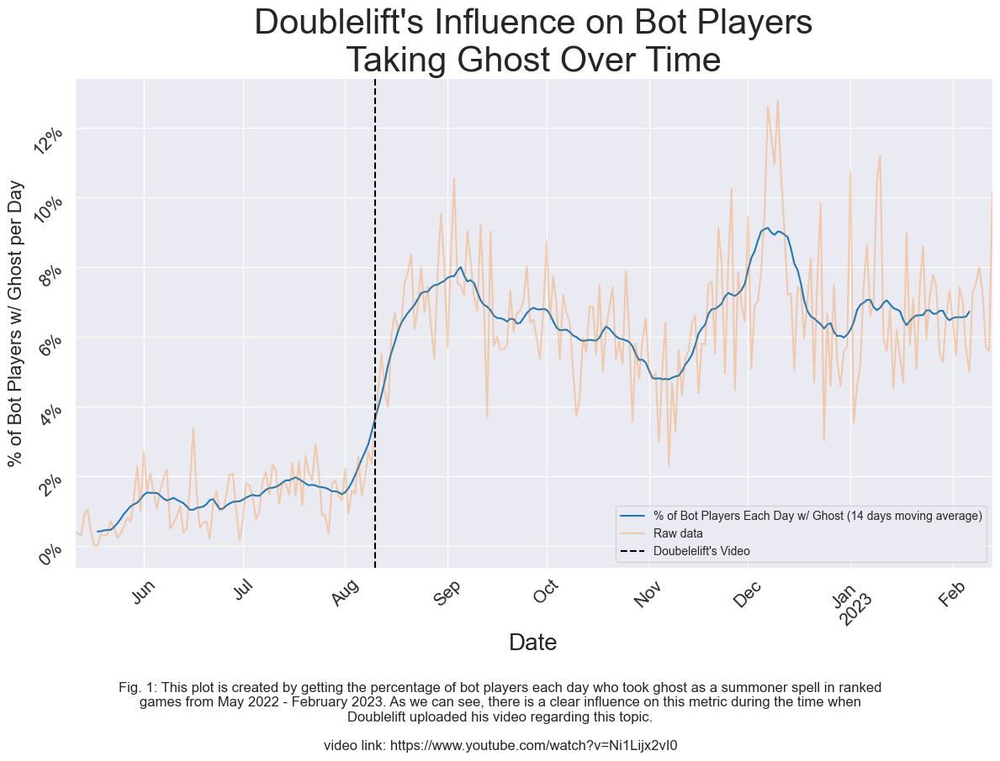

# Doublelift-Ghost

In this notebook we use player data from Riot's API to explore the **influence on the North American League of Legends ranked bottom lane (ADC) community by [Doublelift's video](https://www.youtube.com/watch?v=Ni1Lijx2vI0) regarding why some ADC's should be taking Ghost as their non-flash summoner spells**. The [Jupyter Notebook](Data%20Analysis.ipynb) will follow this format:

1. Getting and cleaning the data.
2. Plotting Doublelift's influence on players taking Ghost.
3. Doing some time series analysis on our data.

## Insights

The main plot is shown below and indicates that: 
**Yes, Doublelift's video influenced North American bot players to take ghost from about 1-2% of the time to 4-10% of the time in ranked games.**

